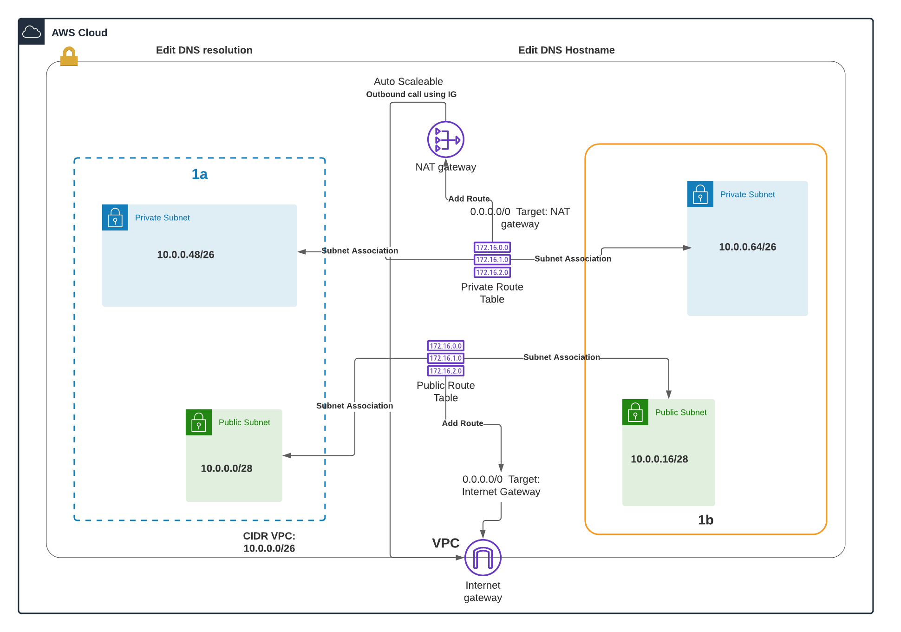
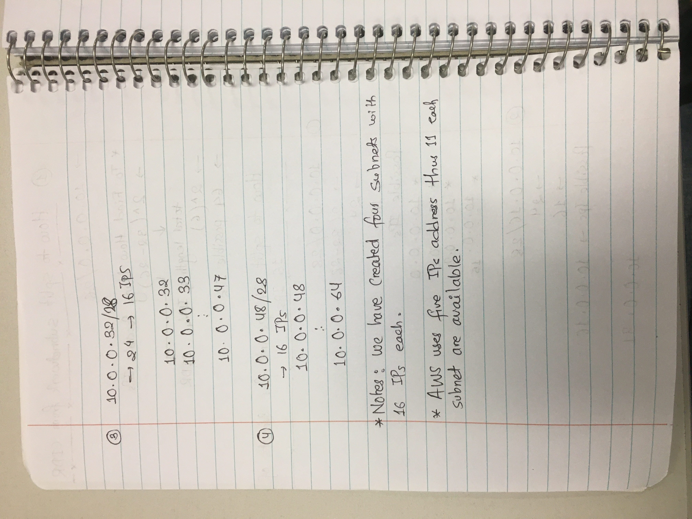

# VPC, Subnet, Route Table, Internet Gateway, NAT Gateway Design consideration #

# Design diagram #

# Splitting VPC CIDR #

# Creating public and private route table for public and private subnet #
1. When VPC is created route table for that VPC will be created.
2. Created route table must be treated as a public route table.
3. For public route table, public subnet must be assigned.
4. For private route table, private subnet must be assigned.
5. One subnet can be assigne to only on route table but one route table can have multiple subnets.

# Attaching Internet gateway to public route table #
1. Create Internet gateway and attach it to VPC.
2. Goto public route table and click on add route
3. The 0.0.0.0/0 Internet gateway means all outbound traffic is routed through Internet gateway.
4. Thus, click on public route table
5. Click on Add route
6. Add outbound route to Internet Gateway

# Attaching NAT gateway to private route table #
1. Create NAT gateway
2. Goto private route table and click on add route
3. The 0.0.0.0/0 NAT gateway means all outbound traffic is routed through NAT gateway.
4. The NAT gateway communicates with Internet gateway and send traffic to outside world.
5. DNS hostname and resolution are performed by AWS.

## Reference ##
1. https://www.youtube.com/watch?v=tD9vDv0uyI8

