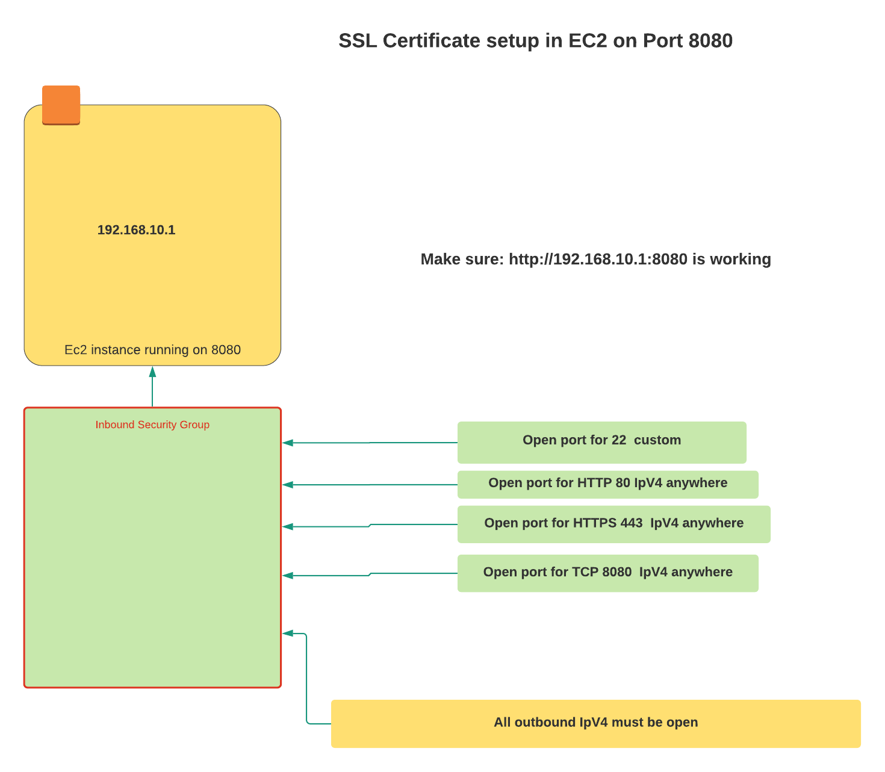
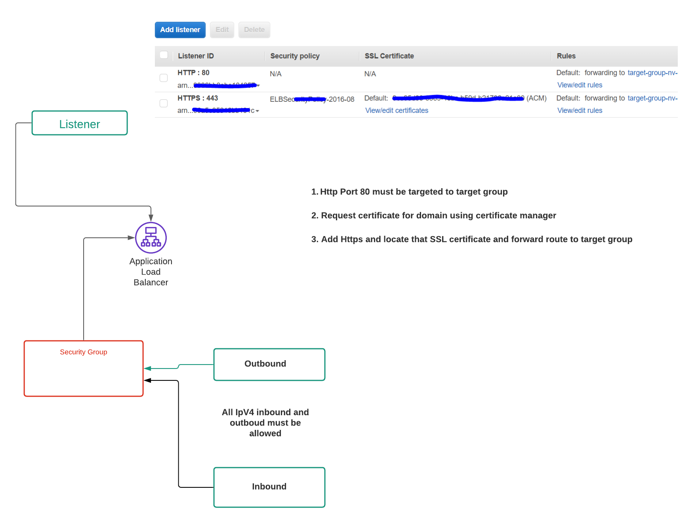
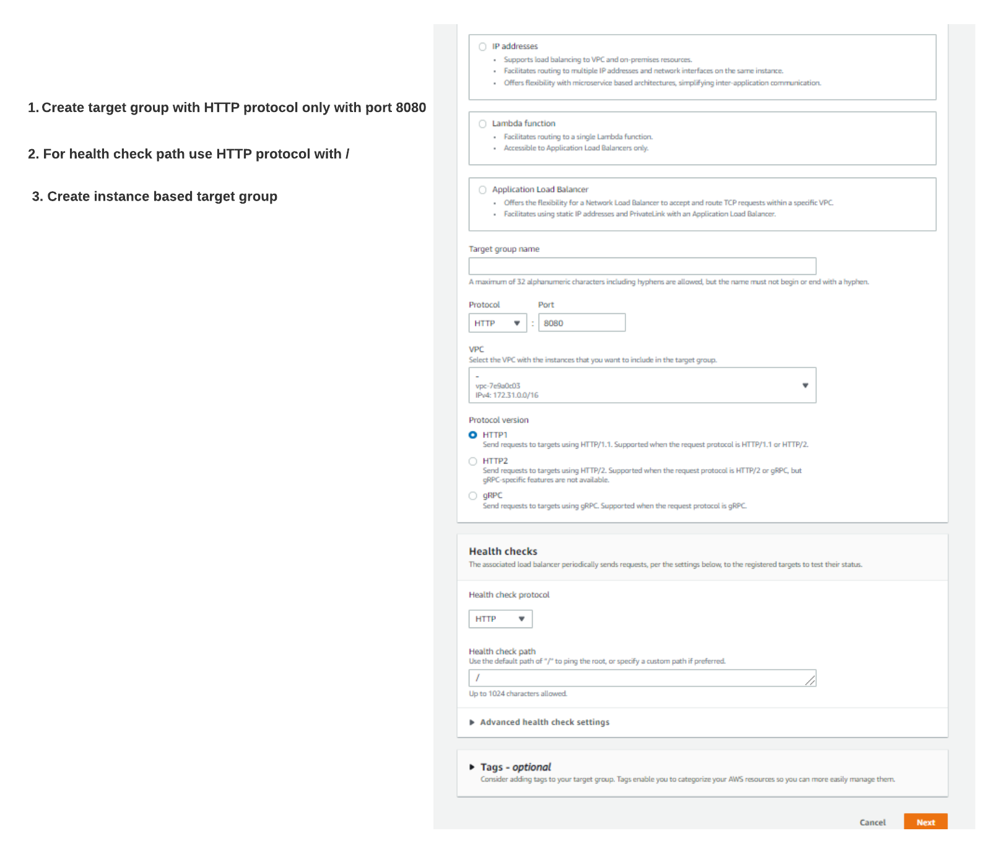
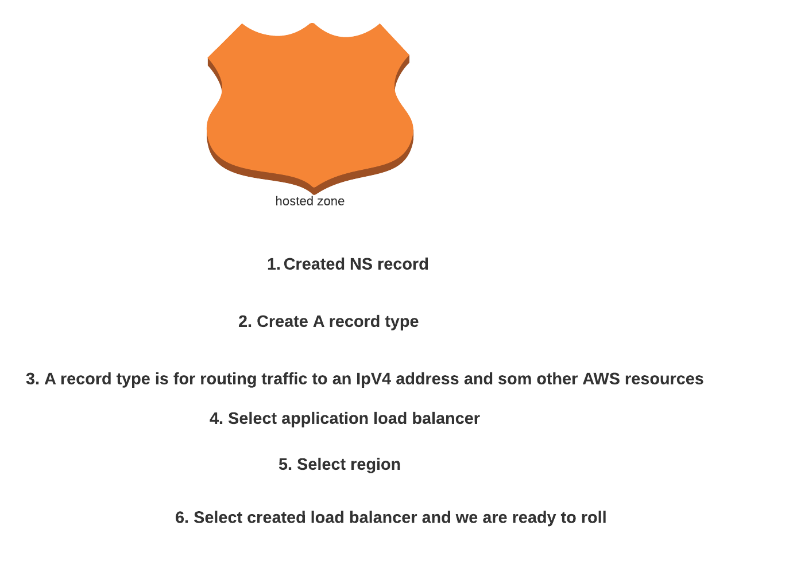

# 1. SSL/TLS setup for API server on Port 8080 #

## 1.1 Run EC2 with port 8080 ##

## 1.2. Create load balancer with HTTP and HTTPS rules ##

## 1.3 Create target group to route HTTP 8080 ##

## 1.4 Create record inside hosted zone ##

# 2. Reference #
1. https://www.youtube.com/watch?v=dMVy3BQB314